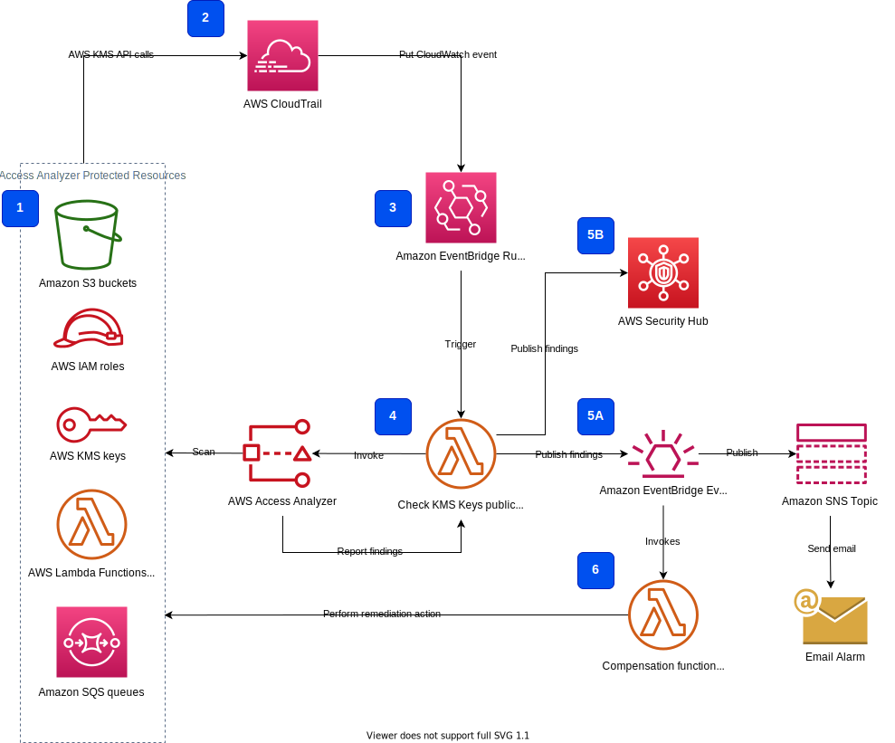

# access-analyzer-kms

Code repository for the security blog post about detecting the public access to the KMS customer keys using IAM Access Analyzer



## Repository structure
- `artefacts/`: samples of Access Analyzer output and email content example  
- `design/`: Architecture diagram for the solution
- `events/`: CloudWatch Events rule setup
- `functions/`: Lambda function
- `policies/`: Lambda execution role policies and KMS keys policies

## Deployment
You can choose to deploy the solution either as Serverless Application Model (SAM) application via SAM CLI or manually via command line using AWS CLI.
Both methods require Administrator access to your account.

### Serverless Application Model (SAM) deployment
The solution is delivered as a SAM application. Follow the instructions to deploy the solution to your AWS account:

1. Install [SAM CLI](https://docs.aws.amazon.com/serverless-application-model/latest/developerguide/serverless-sam-cli-install.html) if you do not have it
2. Clone the source code repository to your local environment
3. Build and deploy solution using the SAM CLI in the solution directory:
```bash
% sam build
```
```bash
% sam deploy --guided
```

### Manual deployment
Alternatively, you can deploy the solution step by step by executing the following command line statements.

#### Clone the source code repository to your local enviroment
```bash
git clone <git-repository>
cd access-analyzer-kms
```

#### Create SNS topic and subscription
```bash
aws sns create-topic --name access-analyzer-kms-keys-findings
```

Replace `TOPIC_ARN` with the SNS topic arn returned from the previous command and `YOUR_EMAIL_ADDRESS` with your email address
```bash
aws sns subscribe \
    --topic-arn <TOPIC_ARN> \
    --protocol email \
    --notification-endpoint <YOUR_EMAIL_ADDRESS>
```

#### Create Lambda execution role  
To create our Lambda function, we need first to create an [execution role](https://docs.aws.amazon.com/lambda/latest/dg/lambda-intro-execution-role.html) that the function will assume:

```bash
aws iam create-role \
    --role-name access-analyzer-kms-function-role \
    --assume-role-policy-document '{"Version": "2012-10-17","Statement": [{ "Effect": "Allow", "Principal": {"Service": "lambda.amazonaws.com"}, "Action": "sts:AssumeRole"}]}'
```

This call returns the execution role ARN which you will need in the step “Create Lambda function”.

Attach the AWS managed policy `AWSLambdaBasicExecutionRole` to the Lambda execution role:

```bash
aws iam attach-role-policy \
    --role-name access-analyzer-kms-function-role \
    --policy-arn arn:aws:iam::aws:policy/service-role/AWSLambdaBasicExecutionRole
```

Along with basic Lambda execution permissions for creating CloudWatch log stream and putting log events into the log stream, we need to add specific permissions to allow our function to perform the following actions:
-	Create Access Analyzer (together with permission to create a [service-linked role](https://docs.aws.amazon.com/IAM/latest/UserGuide/id_roles_terms-and-concepts.html#iam-term-service-linked-role))
-	Work with Access Analyzer API
-	List and describe AWS KMS keys
-	Publish to Amazon SNS topic

Attach the custom permission policy with these permissions to the function execution role. Replace `SNS_TOPIC_ARN` and `ACCOUNT_ID` placeholder in the file [lambda-function-access-analyzer-KMS-permissions.json](policies/lambda-function-access-analyzer-KMS-permissions.json):
```bash
aws iam put-role-policy \
    --role-name access-analyzer-kms-function-role \
    --policy-name LambdaAccessAnalyzerKMSExecutionRole \
    --policy-document file://policies/lambda-function-access-analyzer-KMS-permissions.json
```

#### Create Lambda function
Now you can create the lambda funtion.
Replace `ROLE_ARN` with the ARN from `aws iam create-role` call and `TOPIC_ARN` with the ARN from `aws sns create-topic` call:
```bash
aws lambda create-function \
    --function-name access-analyzer-kms-function \
    --runtime python3.8 \
    --handler access_analyzer_kms_function.lambda_handler \
    --role <ROLE_ARN> \
    --timeout 120 \
    --environment Variables={SNS_TOPIC_ARN=<TOPIC_ARN>} \
    --zip-file fileb://functions/access_analyzer_kms_function.zip
```

#### Create a CloudWatch Events rule and wire it to the Lambda function
The last step in the deployment of the Access Analyzer-based public access detection solution is to set up a CloudWatch Events rule which will trigger the Lambda function.
We want to trigger the Access Analyzer KMS key scan on any changes in key policy or on creation of a key grant.
The two API operations responsible for this are `PutKeyPolicy` and `CreateGrant`.

To create a rule that triggers on those actions we should capture those specific AWS KMS API calls in CloudWatch via AWS CloudTrail using the following event pattern:
```json
{
    "source": [
        "aws.kms"
    ],
    "detail-type": [
        "AWS API Call via CloudTrail"
    ],
    "detail": {
        "eventSource": [
            "kms.amazonaws.com"
    ],
    "eventName": [
        "PutKeyPolicy",
        "CreateGrant"
    ]
    }
}
```

First, create the CloudWatch Events rule:
```bash
aws events put-rule \
    --name kms-key-access-changes \
    --event-pattern "{\"source\": [\"aws.kms\"],\"detail-type\": [\"AWS API Call via CloudTrail\"],\"detail\": {\"eventSource\": [\"kms.amazonaws.com\"],\"eventName\": [\"PutKeyPolicy\",\"CreateGrant\"]}}" 
```

To allow the CloudWatch Events rule to invoke our Lambda function we must add the resource-based policy to the function. Replace `RULE_ARN` with the ARN returned from the `aws events put-rule` call:
```bash
aws lambda add-permission \
    --function-name access-analyzer-kms-function \
    --statement-id CloudWatchEventsRuleLambdaPermission \
    --action 'lambda:InvokeFunction' \
    --principal events.amazonaws.com \
    --source-arn <RULE_ARN>
```

Now, with the rule and permissions in place, we need to link the rule and the function (target). Replace `FUNCTION_ARN` with the Lambda function ARN from the `aws lambda create-function` call:
```bash
aws events put-targets \
    --rule kms-key-access-changes \
    --targets "Id"="1","Arn"="<FUNCTION_ARN>"
```

## Test detection of public access for AWS KMS key polices
Create a KMS key:
```bash
aws kms create-key \
    --description "Access Analyzer KMS customer key scan test"
```

Make the key public by adding `"*"` to the allowed principal list. Replace `KEY_ID` with the value returned by `aws kms create-key` call. Replace `ACCOUNT_ID`:
```bash
aws kms put-key-policy \
    --key-id <KEY_ID> \
    --policy-name default \
    --policy "{\"Version\": \"2012-10-17\",\"Id\": \"key-default-policy\",\"Statement\": [{\"Sid\": \"Enable IAM User Permissions\",\"Effect\": \"Allow\",\"Principal\": {\"AWS\": [\"arn:aws:iam::ACCOUNT_ID:root\",\"*\"]},\"Action\": \"kms:*\",\"Resource\": \"*\"}]}"
```

Check your email. You will receive a notification from the Lambda function about public access to your KMS key.

Set the policy to private again. Replace `KEY_ID` with the value returned by `aws kms create-key` call. Replace `ACCOUNT_ID`:
```bash
aws kms put-key-policy \
    --key-id <KEY_ID> \
    --policy-name default \
    --policy "{\"Version\": \"2012-10-17\",\"Id\": \"key-default-policy\",\"Statement\": [{\"Sid\": \"Enable IAM User Permissions\",\"Effect\": \"Allow\",\"Principal\": {\"AWS\": [\"arn:aws:iam::906545278380:root\"]},\"Action\": \"kms:*\",\"Resource\": \"*\"}]}"
```


Copyright Amazon.com, Inc. or its affiliates. All Rights Reserved.
SPDX-License-Identifier: MIT-0